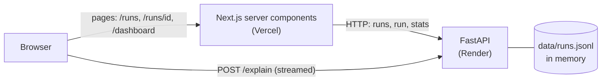

# Agent Run Explorer

A small web tool for browsing and understanding AI agent runs. A FastAPI backend serves 200 runs from a JSONL file, and a Next.js frontend lets you filter, search, sort and page through them, read a run's steps, stream a natural-language explanation of a run, and see charts of the whole dataset.

## Live

| | |
|---|---|
| App | https://agent-run-explorer-lovat.vercel.app |
| API health | https://agent-run-explorer.onrender.com/api/health |
| API docs (Swagger) | https://agent-run-explorer.onrender.com/docs |

The backend is on Render's free tier, which sleeps after about 15 minutes without traffic. If it is asleep, the first request can take up to about a minute while it wakes. A GitHub Actions workflow (`.github/workflows/keep-awake.yml`) pings it every 14 minutes, so this should be rare.

## Features

Mapped to the brief's "Must build":

- **`GET /api/runs`**: pagination with a total count, multi-value `status`, `agent` and `tool` filters (`tool` matches runs where any step used it), a `started_at` date range, text search over the prompt, sort by `started_at`, `duration_ms` or `cost_usd`. All filters compose in one request. Steps are not included in list items.
- **`GET /api/runs/{id}`**: one run with its steps; a proper 404 for an unknown id.
- **`GET /api/stats`**: run counts and success rate (overall and per agent), median and p95 duration, total cost per agent (with priced/unpriced counts), runs per day (zero-filled). Accepts the same filters as `/api/runs`.
- **`POST /api/runs/{id}/explain`**: streamed text from a deterministic mock provider (no API key needed), chosen by `EXPLAIN_PROVIDER`.
- **`/runs`**: server-rendered list. All state (filters, search, sort, page) is in the URL, so a filtered view can be copied and reopened. Visible loading, empty and error states. Also:
  - **Tool filter:** chips for the five tools, combined with every other filter.
  - **Request indicator:** a small line under the list, such as `List request: 84 ms · 3 requests this session`. It shows the time of the list request and counts the list requests this browser tab has made, so you can see that a filter change costs one request and typing in the search box costs one per pause, not one per keystroke. The list request is the only backend call the page makes.
  - **Keyboard:** ↑ ↓ move between rows (starting at the first or last row when nothing is focused) and Enter opens the run, keeping the list's filters for "Back to runs". Arrow keys are never taken from the search box, selects or buttons.
- **`/runs/[id]`**: metadata, the error (if any), steps in order with duration and tokens, step input/output readable in place, warnings, and a streaming "Explain this run" button. `/runs/run_0042#step-3` deep-links to a step: it is highlighted, scrolled into view, and its input and output open fully expanded even when long.
- **`/dashboard`**: stat tiles and three charts (runs per day, cost per agent, runs by status per agent). Clicking a bar opens the matching filtered `/runs`.
- **Tests**: 56 backend tests (including filters composing and a statistic checked against a hand-computed value) and 53 frontend tests (Vitest).

Data problems in the dataset (a duplicate id, a negative duration, a run with no steps, unpriced runs) are detected at load time, reported in `data_warnings`, and shown in the UI. See [DECISIONS.md](DECISIONS.md).

## Brief checklist

| Brief item | Where it is |
|---|---|
| **Must:** `GET /api/runs` (pagination, multi-value filters, date range, search, sort, composing) | `backend/app/main.py` (`list_runs`, shared `get_filters`), `backend/app/filters.py` |
| **Must:** `GET /api/runs/{id}` with a proper 404 | `backend/app/main.py` (`get_run`) |
| **Must:** `GET /api/stats` | `backend/app/stats.py`, `backend/app/main.py` (`get_stats`) |
| **Must:** `POST /api/runs/{id}/explain`, streamed, mock provider | `backend/app/explain.py`, `backend/app/main.py` (`explain_run`) |
| **Must:** `/runs` with URL state, loading, empty and error states | `frontend/app/runs/`, `frontend/components/RunFilters.tsx`, `RunsResults.tsx`, `frontend/lib/filters.ts` |
| **Must:** `/runs/[id]` with error, steps, streaming Explain | `frontend/app/runs/[id]/page.tsx`, `StepsTimeline.tsx`, `StepValue.tsx`, `ExplainRun.tsx` |
| **Must:** `/dashboard` with charts | `frontend/app/dashboard/page.tsx`, `frontend/components/charts/` |
| **Must:** backend tests (filters compose, a hand-computed statistic) | `backend/tests/test_runs.py`, `backend/tests/test_stats.py` with `fixtures/stats_fixture.jsonl` |
| **Must:** a frontend test | `frontend/tests/` (Vitest) |
| **Must:** the four decisions, 20-million-run answer, what's next | [DECISIONS.md](DECISIONS.md) |
| **Should:** `tool` filter | `filters.py` and `main.py` (backend), `RunFilters.tsx` chips (frontend) |
| **Should:** deep link to a step, opened expanded | `frontend/lib/useLocationHash.ts`, `StepValue.tsx` |
| **Should:** keyboard navigation in the list | `frontend/components/KeyboardRows.tsx`, `frontend/lib/rowNavigation.ts` |
| **Should:** request duration and count indicator | `frontend/components/RequestIndicator.tsx`, `frontend/lib/requestCounter.ts`, `fetchRunsTimed` in `frontend/lib/api.ts` |
| **Stretch:** cursor pagination, 500-step runs, Docker Compose | Not built. |

More detail: [docs/ARCHITECTURE.md](docs/ARCHITECTURE.md) (design and request flows) and [SECURITY.md](SECURITY.md) (current posture and what production would need).

## Architecture



- **Backend**: Python 3.12, FastAPI, Pydantic. The JSONL file is read into memory once at startup.
- **Frontend**: Next.js (App Router), React, TypeScript, Tailwind, Recharts.
- Two separate processes over HTTP. The Next.js server fetches data from the API; the browser calls the API directly only for the streaming explain, so the text is not buffered by an extra hop.

## Run it locally

**Prerequisites:** Python 3.12 (tested with 3.12.10) and Node.js 20.9 or newer (tested with Node 24.19 and npm 11.17). Nothing else.

Open two terminals at the repo root.

### 1. Backend (terminal 1)

Windows PowerShell:

```powershell
cd backend
python -m venv .venv
.venv\Scripts\python -m pip install -r requirements.txt
.venv\Scripts\python -m uvicorn app.main:app --port 8000
```

macOS / Linux:

```bash
cd backend
python3 -m venv .venv
.venv/bin/python -m pip install -r requirements.txt
.venv/bin/python -m uvicorn app.main:app --port 8000
```

Check it: http://localhost:8000/api/health should show `"run_count":200`. Interactive docs are at http://localhost:8000/docs.

### 2. Frontend (terminal 2)

Windows PowerShell:

```powershell
cd frontend
npm ci
Copy-Item .env.example .env.local
npm run dev
```

macOS / Linux:

```bash
cd frontend
npm ci
cp .env.example .env.local
npm run dev
```

Open http://localhost:3000 (it redirects to `/runs`). Also try http://localhost:3000/dashboard.

The backend needs no `.env` file: every backend variable has a default. The frontend needs `.env.local` (copied above) so it knows where the backend is.

## Tests and checks

```bash
# Backend: 56 tests (from backend/, with the venv's Python)
.venv/bin/python -m pytest          # Windows: .venv\Scripts\python -m pytest

# Frontend (from frontend/)
npm test                            # Vitest, 53 tests
npm run lint
npm run build
```

## Environment variables

Also listed, with comments, in [.env.example](.env.example) (backend variables) and [frontend/.env.example](frontend/.env.example).

| Name | Used by | Default | Example |
|---|---|---|---|
| `DATA_PATH` | backend | `data/runs.jsonl` at the repo root | `../data/runs.jsonl` |
| `EXPLAIN_PROVIDER` | backend | `mock` (the only allowed value) | `mock` |
| `EXPLAIN_MOCK_DELAY_MS` | backend | `40` | `40` |
| `CORS_ORIGINS` | backend | empty (`http://localhost:3000` is always allowed) | `https://your-app.vercel.app` |
| `API_URL` | frontend, server side | none (required) | `http://localhost:8000` |
| `NEXT_PUBLIC_API_URL` | frontend, browser | none (required) | `http://localhost:8000` |

`CORS_ORIGINS` is a comma-separated list of exact origins (scheme and host, no trailing slash). `NEXT_PUBLIC_API_URL` is baked into the JavaScript at build time, so changing it needs a rebuild or redeploy.

## API reference

Base URL: `http://localhost:8000` locally. Errors are JSON: `{"detail": "..."}`.

### `GET /api/runs`

| Param | Meaning |
|---|---|
| `status` | repeatable: `succeeded`, `failed`, `cancelled`, `running` |
| `agent` | repeatable: `contract-reviewer`, `email-drafter`, `invoice-extractor`, `kpi-analyst`, `support-router` |
| `tool` | repeatable: `llm`, `sql`, `http`, `vector_search`, `none`. Matches runs where any step uses one of them; a run with no recorded steps matches none |
| `started_from`, `started_to` | `YYYY-MM-DD`, inclusive of whole days |
| `q` | case-insensitive text search in the prompt |
| `sort` | `started_at` (default), `duration_ms`, `cost_usd` |
| `order` | `desc` (default), `asc` |
| `page` | from 1 (default 1) |
| `page_size` | 1 to 100 (default 25) |

Example: `/api/runs?agent=kpi-analyst&status=failed&page_size=1`

```json
{
  "items": [
    {
      "id": "run_0089", "agent": "kpi-analyst", "model": "claude-opus-5", "status": "failed",
      "started_at": "2026-08-23T22:31:13Z", "ended_at": "2026-08-23T22:31:36.164000Z",
      "duration_ms": 23164, "input_tokens": 0, "output_tokens": 0, "cost_usd": 0.0,
      "prompt": "Build a summary of pipeline coverage for Q2 and call out risk.",
      "error": { "type": "SchemaMismatch", "message": "Model output missing required field 'severity'", "step_index": 3 },
      "tenant_id": "tenant_10",
      "warnings": ["error points to step 3 but only 0 steps were recorded"],
      "step_count": 0, "has_error": true
    }
  ],
  "total": 8, "page": 1, "page_size": 1
}
```

Errors: `422` for an invalid value (unknown status, agent or tool, `page=0`, `page_size=101`, a bad date) or a reversed range (`started_from` after `started_to`).

### `GET /api/runs/{id}`

Returns one run: the same fields as a list item (without `step_count` and `has_error`) plus `steps`, a list of `{index, name, tool, status, started_at, duration_ms, input, output, tokens: {input, output}}`. Step `index` starts at 0.

Errors: `404` with `{"detail": "Run run_9999 not found"}`.

### `GET /api/stats`

Takes the same filter params as `/api/runs` (`status`, `agent`, `tool`, `started_from`, `started_to`, `q`); sort and paging are ignored. The dashboard calls it with no filters, so it shows the whole dataset.

```json
{
  "overall": { "total": 200, "succeeded": 139, "failed": 44, "cancelled": 8, "running": 9, "success_rate": 0.7277486910994765 },
  "per_agent": [
    { "agent": "contract-reviewer", "total": 41, "succeeded": 27, "failed": 10, "cancelled": 0, "running": 4,
      "success_rate": 0.7297297297297297, "total_cost_usd": 1.530414, "priced_count": 40, "unpriced_count": 1 }
  ],
  "duration": { "median_ms": 23593.0, "p95_ms": 41530, "completed_count": 190 },
  "runs_per_day": [ { "date": "2026-07-20", "count": 4 } ],
  "data_warnings": ["..."]
}
```

`per_agent` and `runs_per_day` are shortened here to show their shape; the real response has one entry per agent and one per day (43 days). `success_rate` is `null` when no run has finished. Errors: `422` as above.

### `POST /api/runs/{id}/explain`

Streams `text/plain` word by word. No request body. Try it:

```bash
curl -N -X POST http://localhost:8000/api/runs/run_0136/explain
```

Errors: `404` for an unknown id, returned before any streaming starts.

### `GET /api/health`

`{"status": "ok", "run_count": 200, "data_warnings": [...]}`. Used by Render's health check and the keep-awake workflow.

## Deployment

**Backend on Render** (free web service, connected to this repo):

- Root directory: empty (the repo root, because `data/runs.jsonl` lives there)
- Build command: `pip install -r backend/requirements.txt`
- Start command: `cd backend && uvicorn app.main:app --host 0.0.0.0 --port $PORT`
- Health check path: `/api/health`
- Python version: pinned by `.python-version`
- Environment: `EXPLAIN_PROVIDER=mock`, `EXPLAIN_MOCK_DELAY_MS=40`, `CORS_ORIGINS=<the Vercel production URL>`

**Frontend on Vercel** (free, connected to this repo):

- Root directory: `frontend`
- Environment: `API_URL` and `NEXT_PUBLIC_API_URL`, both the Render URL (no trailing slash)
- `NEXT_PUBLIC_API_URL` is read at build time: change it, then redeploy.

**CORS:** the browser calls the API directly for Explain, so the backend must allow the frontend's origin through `CORS_ORIGINS`. Server-side fetches from Next.js are not subject to CORS. Vercel preview URLs are different origins and are not allowed, so Explain works on the production URL only.

**Keep-awake:** `.github/workflows/keep-awake.yml` calls `/api/health` every 14 minutes. It reads the backend address from the GitHub repository variable `BACKEND_URL`.

## Project structure

```
backend/
  app/          main.py (routes), data.py (loader), filters.py, stats.py, explain.py, models.py
  tests/        pytest tests and a small stats fixture
frontend/
  app/          pages: /runs, /runs/[id], /dashboard (+ loading and error states)
  components/   UI pieces; components/charts/ holds the Recharts charts
  lib/          api client, URL filter helpers, formatters, types
  tests/        Vitest tests
data/runs.jsonl   the dataset (never edited)
brief/            the assignment brief
.github/workflows/keep-awake.yml
```

## How AI was used

I built this with Claude Code as an assistant. I made the four key decisions myself (see DECISIONS.md), read and reviewed every change, and can explain each line. I worked in small steps, and the commits are small and authored by me. `CLAUDE.md` in the repo holds the working rules I gave the assistant.

## Known limitations

- Data lives in memory, loaded at startup from a file; there is no database.
- Explain uses a mock provider with canned, deterministic text. No real model is connected.
- A run id that does not exist shows the "not found" page but with HTTP status 200, because the loading state is streamed first and the status is already sent. The API itself returns a real 404.
- Step numbers start at 0, as in the data.
- No authentication.
- Explain only works from `localhost:3000` and the production Vercel URL (CORS).
