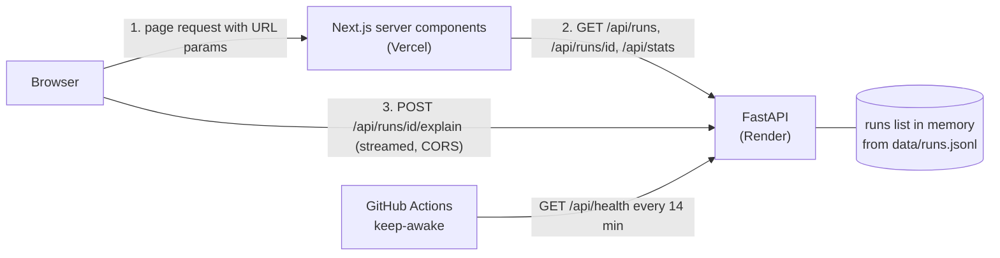

# Architecture

## High-level design

Two separate processes talk over HTTP. There is no database: the backend reads `data/runs.jsonl` into memory once at startup.

| Part | Where | Job |
|---|---|---|
| Next.js (App Router) | Vercel | Renders `/runs`, `/runs/[id]` and `/dashboard` on the server; ships small client components for the parts that need a browser |
| FastAPI | Render | Loads and validates the data, filters/sorts/paginates, computes stats, streams the explanation |
| `data/runs.jsonl` | Inside the backend process | The 200 unique runs, held in a Python list |

### Request flows

- **List page.** The browser asks Next.js for `/runs?status=failed&tool=sql`. The page parses the URL into a typed filter object (`parseFilters`), renders the filter bar, and wraps the results in `Suspense` so a skeleton shows while the server calls `GET /api/runs` on Render. The URL is the only place filter state lives, so a view can be copied and reopened. The numbers on the status and agent chips are whole-dataset counts from the unfiltered stats, kept for a few minutes by `lib/globalStats.ts` (a `use cache` function), so a filter change still costs one backend call.
- **Detail page.** `/runs/[id]` fetches `GET /api/runs/{id}`. A 404 from the API becomes Next's not-found page. The "Back to runs" link comes from `?from=`, which is parsed and rebuilt before use.
- **Explain.** The browser calls `POST /api/runs/{id}/explain` on Render directly, not through Next.js, because an extra server hop can buffer the text and defeat streaming. That is why the backend needs a CORS allow-list.
- **Dashboard.** A server component calls `GET /api/stats` with no filters and renders the stat tiles, one card per agent, the outcome donut, the three charts (all plain HTML and CSS, no chart library) and a collapsible box listing the data anomalies.

### Deployment

Render checks out the whole repo (the dataset lives at the root) and starts `uvicorn` from `backend/`. Vercel builds `frontend/`. Environment variables are listed in `.env.example`: `API_URL` (server-side) and `NEXT_PUBLIC_API_URL` (browser, baked in at build time) on Vercel; `CORS_ORIGINS`, `EXPLAIN_PROVIDER`, `EXPLAIN_MOCK_DELAY_MS`, `DATA_PATH` on Render. Render's free tier sleeps after ~15 minutes idle, so `.github/workflows/keep-awake.yml` calls `/api/health` every 14 minutes.

## Low-level design

### Backend (`backend/app/`)

- **`models.py`**: Pydantic models. `RunStatus`, `AgentName` and `ToolName` are `Literal` types, so the same definitions validate the data and the query parameters. `Run` has a `warnings` list, `valid_duration_ms` (null for a negative duration) and `started_day` (the UTC day). Timestamps are `AwareDatetime`, so one without a timezone fails validation and is reported as a bad line instead of being guessed.
- **`data.py`**: the loader. It parses line by line, so one bad line is skipped and reported instead of stopping startup. It resolves duplicate ids (keeps the copy with the fewest contradictions), adds per-run warnings (including an error step index that is negative or past the last step), and fills the module-level `runs`, `runs_by_id` (so one run is a dict lookup), `dataset_days` (the first and last UTC day of all runs) and `data_warnings`. It never edits the file.
- **`filters.py`**: `RunFilters` (a dataclass) and three plain functions: `filter_runs` (every set filter must match; a `tool` filter matches when *any* step uses it), `sort_runs` (runs with no value for the sort field go last in both directions; `id` breaks ties), and `paginate`. `query_runs` chains them.
- **`stats.py`**: pure functions over a list of runs: status counts and success rate, per-agent cost (priced runs only, plus priced/unpriced counts), median and nearest-rank p95, and zero-filled runs per UTC day. The days are clipped to `dataset_days`, so a filtered view still shows its empty days and a request for year 1 to 9999 cannot loop over millions of days.
- **`explain.py`**: an `ExplainProvider` protocol with one method, `stream(run)`. `MockExplainProvider` builds a deterministic sentence from the run's own fields and yields it a word at a time with an `asyncio.sleep` delay. `get_provider()` reads `EXPLAIN_PROVIDER` at startup, so a bad value stops the server early.
- **`main.py`**: routes and wiring. `get_filters` is a single FastAPI dependency that parses and validates `status`, `agent`, `tool`, the date range and `q`; both `/api/runs` and `/api/stats` use it, so the list and the stats always use the same definition of "matching runs". An invalid value, a `q` longer than 200 characters, or `started_from` after `started_to`, gives a 422. It also sets up CORS from `CORS_ORIGINS`, allowing only GET, POST and OPTIONS and the Content-Type header.

### Frontend (`frontend/`)

- **Server vs client components.** Pages and `RunsResults` are server components: they fetch data and render HTML. Client components are only the parts that need the browser: `RunFilters` (router, debounce, and the "Filters (N active)" toggle that collapses the panel on phones), `QuickInvestigations`, `ExplainRun` (streaming), `StepValue` (expand/collapse), `KeyboardRows`, `RequestIndicator`, `ScrollableTable` (the right-edge fade and "scroll →" hint), `ScrollToStep`, `NavLinks` and `ErrorPanel`. The charts and agent cards are server components.
- **Fonts.** Geist comes from the `geist` npm package, which ships the font files, so the build never needs to reach Google Fonts.
- **`lib/filters.ts`**: the URL-state module. `parseFilters` turns any URL into a valid `RunFilters` (unknown values dropped, fixed order, dates checked), and `toSearchParams` writes only non-default values. It also builds the list, detail and back links, including `backToRunsHref`, which re-parses `?from=`.
- **`lib/api.ts`**: the only place that calls the backend. `fetchRuns`, `fetchRun` and `fetchStats` use `cache: "no-store"`; `fetchRunsTimed` adds the elapsed time and a request id.
- **Request counter.** `lib/requestCounter.ts` keeps a module-level `Set` of request ids; `RequestIndicator` records its id and reads the count with `useSyncExternalStore`. Counting distinct ids means React re-running an effect, or Back showing an old result, does not inflate it.
- **`KeyboardRows`**: wraps the (server-rendered) table. Arrow keys call `nextRowIndex` and move real DOM focus to the next row's link, so Enter, focus styling and screen readers use the browser's own behaviour. A window listener handles the case where nothing is focused.
- **`useLocationHash`**: `useSyncExternalStore` over `hashchange`. The server never sees `#step-3`, so `StepValue` reads the hash in the browser and expands the targeted step.

### One filter change, end to end

1. The user clicks the `sql` chip. `RunFilters` computes the new `tool` list with `toggled`, resets `page` to 1, and calls `router.replace("/runs?tool=sql")` inside a transition (`replace` keeps Back-button history clean; typed search is debounced 300 ms first).
2. Next.js re-renders the server page. `parseFilters` reads `tool=sql`; the `Suspense` key changed, so the skeleton shows.
3. `RunsResults` calls `fetchRunsTimed`, which sends `GET /api/runs?tool=sql` to Render.
4. FastAPI's `get_filters` validates `tool` against the `ToolName` literal, `filter_runs` keeps runs where any step used `sql`, `sort_runs` and `paginate` produce the page, and the response has `items` (no steps) and `total`.
5. The server renders the table and the `RequestIndicator`; the browser swaps in the new HTML. The indicator shows the time and one more distinct request.

## Design decisions

The four decisions the brief asked for are in [DECISIONS.md](../DECISIONS.md). These are the smaller ones I made along the way.

- **URL is the single source of truth** for filters, search, sort and page, so a view can be shared. The page is a server component that reads the URL; no separate client state.
- **`router.replace`, not `push`**, for filter changes, so each keystroke or checkbox doesn't add a Back-button entry. Search is debounced.
- **Suspense `key`** built from the filters, so the loading skeleton shows again when the filters change.
- **Server vs client components:** data is fetched in server components; only things that need the browser are client components that receive plain props: the filter bar, quick investigations, Explain, step expand/collapse, keyboard rows, the request indicator, the table scroll hint, scroll-to-step, the nav links and the error panel. The charts and agent cards are server components.
- **Explain is called from the browser**, straight to the backend. Going through a Next.js server hop could buffer the text and defeat streaming. This is why CORS is needed.
- **`?from=` back link** carries the list's filters to the detail page. It is validated by parsing it and rebuilding the URL, so a value like `//evil.com` can only ever produce `/runs`.
- **Tool filter:** a run matches when *any* of its steps uses one of the chosen tools, and a run with no recorded steps (`run_0089`) matches none. It goes through the same shared filter as everything else, so `/api/stats` respects it too.
- **Request indicator:** the list request is timed on the Next.js server, because that is where the backend call happens. Each request gets an id and the browser counts distinct ids, so React re-running an effect or Back showing an old result can't inflate the count. The agent list is a fixed constant in the frontend (mirroring the backend's `Literal`), so a filter change makes just the one list request. (The counts on the status and agent chips and the header pill come from the unfiltered stats, which the Next.js server keeps for a few minutes.)
- **Keyboard navigation moves real focus** between the run links instead of keeping a separate "selected row" state, so Enter, focus styles and screen readers use what the browser already provides. It ignores keys with modifiers and never acts while focus is in a text field, select or button.
- **Deep link opens the step expanded** by reading the URL fragment with `useSyncExternalStore`, because the server never sees the `#` part. Clicking "Jump to step N" works too, but clicking it again when the hash already matches does nothing, so a step you collapsed by hand stays collapsed.
- **Step numbers start at 0**, matching `index` in the data and `error.step_index`.
- **Median and p95:** median is the middle value (average of the two middle ones when even); p95 uses nearest-rank (the value at rank ceil(0.95 × n)). Both use only non-running runs with a valid, non-negative duration.
- **Charts are plain HTML and CSS**, not a chart library. The three charts are simple bars, so a library would add a dependency for little. Each bar is a real link to the matching runs, with a spoken label, and each chart has a one-sentence summary.
- **Duration bars** in the list are measured against the slowest valid run in the whole dataset (`max_ms` from `/api/stats`, which the Next.js server already keeps for a few minutes), so the same run has the same bar on every page and a filter change still costs one backend call. If the stats are unavailable the list falls back to the slowest run on the page, and the tooltip says so. The dashboard uses `min_ms` and `max_ms` to place the median and p95 on their tile bars.
- **Vitest on pure functions:** URL parsing, the back-link safety check and formatting are where bugs would be silent. A component or end-to-end test would need extra tooling that I judged not worth it in the time.
- **Hardening:** bounded stats range, input limits, id index.
- **Free hosting:** Render (backend) and Vercel (frontend), plus a GitHub Actions ping every 14 minutes to avoid Render's idle sleep. A best-effort workaround, not production practice.
